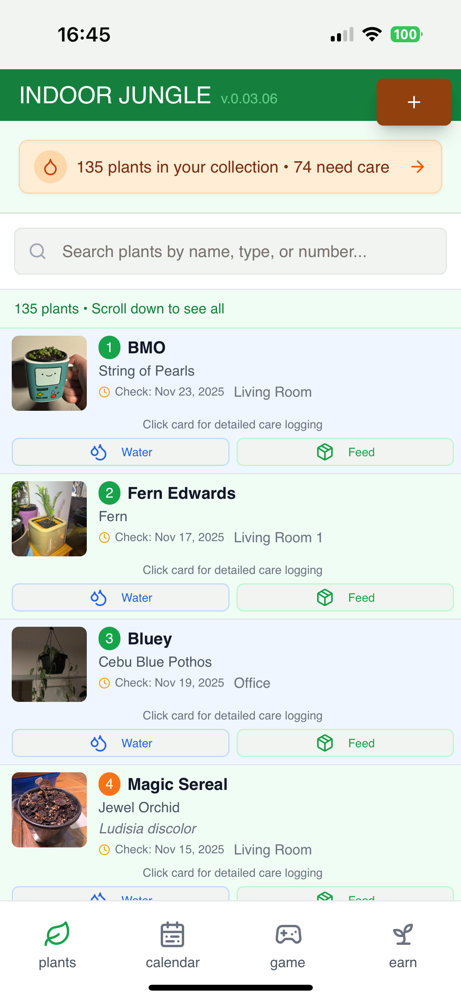

# Indoor Jungle Landing Page

This is the public landing page for Indoor Jungle - a hybrid plant care tracker and Web3 gaming ecosystem.

07.11.25 landing page req's art screenshots and proofing v0.03.06

**Live Site:** https://jarmanbot.github.io/INDOOR-JUNGLE-LANDING-PAGE/

---

## 🌐 Site Structure

The landing page consists of **5 interconnected pages**:

### 1. **index.html** - Navigation Hub
- Main entry point with navigation to all sections
- Brief overview and signup form
- Links to: Plant Tracker, Game Info, Phigital Pots, Beta Guide

### 2. **tracker.html** - Plant Care Tracker (Public)
- Public marketing page for the tracker app features
- Showcases core functionality with screenshots
- Numbered plant system, calendar, care logging, photo tracking

### 3. **game.html** - 10 Eras of Growth
- Explains the Web3 game progression system
- Property levels from studio apartment to luxury mansion
- LVS token economy and NFT integration

### 4. **phigital-pots.html** - NFT Plant Pots
- Explains phigital (physical + digital) NFT pot concept
- How NFT value grows with tracker usage + game advancement
- Where to buy: local nurseries, Indoor Jungle website, in-game

### 5. **beta-guide.html** - Beta User Tutorial (Email-Only)
- Comprehensive step-by-step guide for beta testers
- Sent via email after signup
- NOT linked in main navigation (has noindex meta tag)

---

## 📋 Quick Start Checklist

After pushing these files to GitHub, complete these tasks to go live:

- [ ] Enable GitHub Pages (Settings → Pages → Deploy from main/root)
- [ ] Update URLs in all HTML files with your GitHub Pages URL
- [ ] Add all app screenshots to `landing-page/images/` folder
- [ ] Replace screenshot placeholder divs with `` tags
- [ ] Add your social media links (Facebook, Instagram)
- [ ] Connect email signup form to your email service
- [ ] Create legal pages (terms.html, privacy.html, disclaimer.html)
- [ ] Test on mobile devices

---

## 📸 Screenshots Guide

All screenshots should be saved to `landing-page/images/` folder with these exact filenames:

### Common Files (All Pages)
```
logo.png                          # Indoor Jungle app icon (already exists)
```

### tracker.html Screenshots (5 files)
```
screenshot-plant-list.png         # Main plant list with numbered plants
screenshot-dropdown.png           # Dropdown menu showing options
screenshot-calendar.png           # Calendar view with care schedule
screenshot-missed-care.png        # Missed care tasks page/view
screenshot-plantid.png            # Individual plant detail page
```

### game.html Screenshots (1 file)
```
screenshot-game-eras.png          # Comparison of different era properties
```

### phigital-pots.html Images (4 files)
```
pot-concept-basic.png             # Basic terracotta NFT pot concept art
pot-concept-premium.png           # Premium ceramic NFT pot concept art
pot-concept-luxury.png            # Luxury designer NFT pot concept art
screenshot-nft-dashboard.png      # NFT dashboard showing owned pots
```

### beta-guide.html Screenshots (11 files)
```
screenshot-ios-install.png        # iOS PWA installation steps
screenshot-android-install.png    # Android PWA installation steps
screenshot-add-plant.png          # Add plant form
screenshot-care.png               # Care logging form
screenshot-quick-actions.png      # Quick action buttons on plant cards
screenshot-recommendations.png    # AI care recommendations
screenshot-analytics.png          # Analytics dashboard view
screenshot-environmental.png      # Environmental monitor (temp/humidity)
screenshot-settings.png           # Settings page
screenshot-game-interface.png     # Game interface for virtual plants
screenshot-notifications.png      # Notification settings page
```

### Screenshot Specifications

- **Format:** PNG (preferred) or JPG
- **Mobile Screenshots:** 1179 x 2556 px
- **Desktop Screenshots:** 1920 x 1080 px (16:9 aspect ratio) 
- **File Size:** Under 500KB each (compress with [TinyPNG](https://tinypng.com/))
- **Quality:** High resolution, clear UI elements, no sensitive user data

---

## 📤 Uploading Screenshots

### Method 1: Upload to Replit (Recommended)

1. In this Replit project, navigate to `landing-page/images/` folder
2. Upload your screenshots with the exact filenames listed above
3. Once all images are uploaded, proceed to Method 2

### Method 2: Upload to GitHub

1. Go to your GitHub repository: https://github.com/jarmanbot/INDOOR-JUNGLE-LANDING-PAGE
2. Navigate to the `images/` folder (create if it doesn't exist)
3. Click **Add file** → **Upload files**
4. Drag and drop all screenshots from `landing-page/images/` folder
5. Commit the changes

---

## 🖼️ Replacing Screenshot Placeholders

After uploading screenshots, replace the placeholder divs with actual `` tags:

### Find placeholders like this:
```html
<div class="screenshot-placeholder">
    <span>Plant List Screenshot</span>
</div>
```

### Replace with:
```html

```

### Replacement Guide by File:

#### tracker.html
- Line ~67: Replace "Plant List Screenshot" placeholder with ``
- Line ~98: Replace "Dropdown Menu Screenshot" with ``
- Line ~167: Replace "Calendar Screenshot" with ``
- Line ~197: Replace "Missed Care Screenshot" with ``
- Line ~227: Replace "Plant ID Screenshot" with ``

#### game.html
- Line ~330: Replace "Era Comparison Screenshot" with ``

#### phigital-pots.html
- Line ~226: Replace placeholder with ``
- Line ~242: Replace placeholder with ``
- Line ~258: Replace placeholder with ``
- Line ~350: Replace "NFT Dashboard Screenshot" with ``

#### beta-guide.html ✅ COMPLETE
All screenshot placeholders have been replaced with `` tags ready for the 11 required screenshots.

---

## 🔧 Initial Setup

### 1. Update URLs in HTML Files

**IMPORTANT:** Replace all placeholder URLs before going live.

**In each HTML file's `<head>` section:**

Find and replace:
```html
<meta property="og:url" content="https://yourusername.github.io/indoor-jungle/">
```

With:
```html
<meta property="og:url" content="https://jarmanbot.github.io/INDOOR-JUNGLE-LANDING-PAGE/">
```

Do this for all occurrences in the meta tags (OG and Twitter cards) across ALL 5 HTML files.

Also update image URLs:
```html
<meta property="og:image" content="https://jarmanbot.github.io/INDOOR-JUNGLE-LANDING-PAGE/images/logo.png">
```

**In footer and social sections (all files):**

Replace placeholder social media URLs:
- `https://facebook.com/yourpage` → your actual Facebook page
- `https://instagram.com/yourpage` → your actual Instagram account

### 2. Enable GitHub Pages

1. Go to https://github.com/jarmanbot/INDOOR-JUNGLE-LANDING-PAGE/settings/pages
2. Under "Source", select **Deploy from a branch**
3. Choose **main** branch and **/ (root)** folder
4. Click **Save**

Your site will be live at: `https://jarmanbot.github.io/INDOOR-JUNGLE-LANDING-PAGE/`

---

## 📧 Email Signup Integration

The form currently shows a JavaScript alert. Choose one option to collect real signups:

### Option 1: Formspree (Easiest - Free tier available)

1. Sign up at [formspree.io](https://formspree.io/)
2. Create a new form
3. Copy your form endpoint
4. In `index.html`, update the form tag:
```html
<form id="betaForm" class="signup-form" action="https://formspree.io/f/YOUR_FORM_ID" method="POST">
```
5. Remove or comment out the form handler in `script.js`

### Option 2: Mailchimp

1. Create a Mailchimp account and audience
2. Generate embedded form code
3. Replace the signup form section with Mailchimp's code
4. Style to match existing design

### Option 3: Google Forms

1. Create a Google Form with fields: Name, Email
2. Get the form's pre-filled link to find field IDs
3. Update form action and field names in `index.html`:
```html
<form action="https://docs.google.com/forms/d/e/FORM_ID/formResponse" method="POST">
  <input type="text" name="entry.123456789" placeholder="Your Name" required>
  <input type="email" name="entry.987654321" placeholder="Your Email" required>
</form>
```

---

## 🔒 Legal Pages

Create separate pages for legal content:

### Create terms.html

1. Use a template generator like [TermsFeed](https://www.termsfeed.com/)
2. Copy the structure from `index.html` (header/footer)
3. Replace main content with your Terms of Service
4. Save as `terms.html` in root folder

### Create privacy.html

1. Include data collection, cookies, Firebase usage
2. Copy header/footer structure from `index.html`
3. Save as `privacy.html`

### Create disclaimer.html

1. Add crypto/NFT risk warnings
2. Beta product disclaimers
3. Investment warnings
4. Save as `disclaimer.html`

**Update footer links in all HTML files:**
```html
<li><a href="terms.html">Terms of Service</a></li>
<li><a href="privacy.html">Privacy Policy</a></li>
<li><a href="disclaimer.html">Disclaimer</a></li>
```

---

## 🎨 Customization

### Colors

All colors are defined in `styles.css` using CSS variables that match the Indoor Jungle app:
```css
:root {
    --primary-green: hsl(122, 39%, 39%);
    --primary-light: hsl(120, 10%, 95%);
    --accent-green: #4ADE80;
    --text-dark: hsl(0, 0%, 10%);
    --neutral-light: hsl(120, 10%, 95%);
}
```

### Content Updates

Key sections to customize:
- **index.html**: Hero headline, navigation links
- **tracker.html**: Feature descriptions, marketing copy
- **game.html**: Era descriptions, LVS token economy details
- **phigital-pots.html**: NFT value proposition, purchase options
- **beta-guide.html**: Step-by-step instructions, feature explanations

---

## 📊 Analytics (Optional)

Add Google Analytics to track visitors:

1. Create account at [analytics.google.com](https://analytics.google.com/)
2. Get your tracking ID
3. Add before `</head>` in ALL HTML files:

```html
<!-- Google Analytics -->
<script async src="https://www.googletagmanager.com/gtag/js?id=GA_MEASUREMENT_ID"></script>
<script>
  window.dataLayer = window.dataLayer || [];
  function gtag(){dataLayer.push(arguments);}
  gtag('js', new Date());
  gtag('config', 'GA_MEASUREMENT_ID');
</script>
```

---

## 🌐 Custom Domain (Optional)

To use your own domain (e.g., `indoorjungle.com`):

1. Purchase domain from Namecheap, GoDaddy, etc.
2. In domain registrar, add DNS A records:
   ```
   Type: A, Host: @, Value: 185.199.108.153
   Type: A, Host: @, Value: 185.199.109.153
   Type: A, Host: @, Value: 185.199.110.153
   Type: A, Host: @, Value: 185.199.111.153
   ```
3. Add CNAME record:
   ```
   Type: CNAME, Host: www, Value: jarmanbot.github.io
   ```
4. Create file `CNAME` in repo root with your domain:
   ```
   yourdomain.com
   ```
5. Wait for DNS propagation (up to 24 hours)

---

## 🧪 Testing Checklist

Before announcing the beta:

- [ ] All 5 HTML pages load correctly
- [ ] All screenshots display properly (no placeholder divs)
- [ ] Navigation links work between all pages
- [ ] External social media links work
- [ ] Form submission works with chosen email service
- [ ] Test on real mobile devices (iOS Safari, Android Chrome)
- [ ] Test on desktop browsers (Chrome, Safari, Firefox)
- [ ] Check page speed with [PageSpeed Insights](https://pagespeed.web.dev/)
- [ ] Verify meta tags with [OpenGraph debugger](https://www.opengraph.xyz/)
- [ ] Verify beta-guide.html has noindex tag (should not appear in search)

---

## 📁 File Structure

```
landing-page/
├── index.html              # Navigation hub page
├── tracker.html            # Plant care tracker marketing
├── game.html               # 10 Eras of Growth explanation
├── phigital-pots.html      # NFT pots explanation
├── beta-guide.html         # Beta user tutorial (email-only)
├── styles.css              # All styling (shared across pages)
├── script.js               # Form handling & animations
├── README.md               # This file
└── images/
    ├── logo.png                          # App icon
    ├── screenshot-plant-list.png         # Tracker screenshots
    ├── screenshot-dropdown.png
    ├── screenshot-calendar.png
    ├── screenshot-missed-care.png
    ├── screenshot-plantid.png
    ├── screenshot-game-eras.png          # Game screenshot
    ├── pot-concept-basic.png             # NFT pot concept art
    ├── pot-concept-premium.png
    ├── pot-concept-luxury.png
    ├── screenshot-nft-dashboard.png
    ├── screenshot-ios-install.png        # Beta guide screenshots
    ├── screenshot-android-install.png
    ├── screenshot-add-plant.png
    ├── screenshot-care.png
    ├── screenshot-quick-actions.png
    ├── screenshot-recommendations.png
    ├── screenshot-analytics.png
    ├── screenshot-environmental.png
    ├── screenshot-settings.png
    ├── screenshot-game-interface.png
    └── screenshot-notifications.png
```

---

## 🔄 Publishing Workflow

### Step 1: Prepare in Replit
1. Upload all screenshots to `landing-page/images/` folder
2. Replace placeholder divs with `` tags in HTML files
3. Update social media links
4. Test locally

### Step 2: Upload to GitHub
1. Go to https://github.com/jarmanbot/INDOOR-JUNGLE-LANDING-PAGE
2. Upload all HTML files to root directory
3. Upload `styles.css` and `script.js` to root
4. Upload all images to `/images/` folder
5. Upload this README.md

### Step 3: Enable GitHub Pages
1. Settings → Pages → Deploy from main/root
2. Wait for deployment (1-2 minutes)
3. Visit https://jarmanbot.github.io/INDOOR-JUNGLE-LANDING-PAGE/

### Step 4: Configure Email Collection
1. Set up Formspree, Mailchimp, or Google Forms
2. Update form action in `index.html`
3. Test signup flow

---

## 🆘 Resources

- [GitHub Pages Documentation](https://docs.github.com/en/pages)
- [Formspree Documentation](https://help.formspree.io/)
- [Web.dev Best Practices](https://web.dev/)
- [TinyPNG Image Compression](https://tinypng.com/)
- [OpenGraph Debugger](https://www.opengraph.xyz/)
- [PageSpeed Insights](https://pagespeed.web.dev/)

---

## 📝 Important Notes

- **beta-guide.html** is email-only and should NOT be linked in main navigation
- NFT pots are purchasable at local nurseries, Indoor Jungle website, or in-game
- NFT value grows with TRACKER USAGE + GAME ADVANCEMENT (not plant death - forgiving design)
- All pages share the same `styles.css` and `script.js` for consistency

---

**Indoor Jungle** - Grow real plants. Build virtual worlds. Earn crypto.

Repository: https://github.com/jarmanbot/INDOOR-JUNGLE-LANDING-PAGE
